# Floor Plan Visuals (FPV) Mobil Uygulaması Detaylı Ekran ve Ağaç Yapısı Analizi

Bu doküman, Google Drive üzerindeki **Floor Plan Visuals (FPV)** mobil uygulama tasarımlarına ait tüm ekran görüntülerinin teker teker analiz edilmesiyle oluşturulmuştur. Uygulamanın hiyerarşik sayfa mimarisi, ağaç yapısı ve her bir ekrandaki bileşenlerin (alanlar, butonlar, formlar, seçenekler) detaylı dökümü aşağıda sunulmuştur.

---

## 1. Uygulamanın Genel Mimari ve Sayfa Yapısı (Tree Architecture)

Uygulama, temel olarak **Kimlik Doğrulama / Onboarding** aşamasından sonra **3 Ana Sekmeli (Home, About, ve öne çıkarılmış Order Now)** bir Bottom Navigation (Alt Navigasyon Barı) mimarisine dayanmaktadır. Ayrıca sol üstte bulunan Profil İkonu üzerinden **Hesap Yönetimi (Account)** ekranına derinlemesine geçiş sağlanmaktadır.

Uygulamanın tam ağaç yapısı ve navigasyon yolları aşağıdaki şemada gösterilmiştir:

```mermaid
graph TD
  Onboarding["🔑 Onboarding & Giriş"] --> Login["Müşteri Portalı Giriş Ekranı"]
  Login --> TabBar["📱 Alt Navigasyon Barı (Bottom Bar)"]
  
  TabBar --> TabHome["🏠 1. Ana Sayfa (Home)"]
  TabBar --> TabAccount["👤 2. Hesap (Account Menu)"]
  TabBar --> TabAbout["ℹ️ 3. Hakkında (About)"]
  TabBar --> TabOrder["⚡ 4. Şimdi Sipariş Ver (Order Now)"]
  
  TabHome --> HomeDash["Gösterge Paneli (Dashboard)"]
  HomeDash --> Notifications["Bildirimler Sayfası"]
  HomeDash --> OrderDetails["Sipariş Detayları"]
  OrderDetails --> ActiveOrder["Aktif Sipariş (#DEMO-001)"]
  OrderDetails --> AwaitingAppt["Randevu Bekleyen (#DEMO-002)"]
  OrderDetails --> ClosedOrder["Tamamlanan Sipariş (#000-D004)"]
  ClosedOrder --> ViewPlans["Planları Görüntüle"]
  ClosedOrder --> ViewInvoice["Faturayı Görüntüle"]

  TabAccount --> AccProfile["Profil Bilgileri Kartı"]
  TabAccount --> ProfileEditor["Profil Editörü Modalı"]
  TabAccount --> OrdersList["Sipariş Listesi (Tüm Siparişler)"]
  TabAccount --> AutofillPref["Otomatik Doldurma Tercihleri"]
  TabAccount --> Wallet["Cüzdan (Ödeme Kartları)"]
  Wallet --> AddDemoCard["Demo Kart Ekle Modalı"]
  TabAccount --> Favorites["Favoriler (Kaydedilenler)"]
  TabAccount --> FeedbackHub["Geri Bildirim Merkezi (Tester)"]
  FeedbackHub --> SubmitFeedback["Geri Bildirim Gönder Modalı"]

  TabAbout --> AboutMain["Hakkında Ana Sayfa"]
  AboutMain --> ContactPage["Ofis İletişim Bilgileri (15+ Eyalet)"]
  AboutMain --> WebSite["Web Sitesini Aç Linki"]
  AboutMain --> ChatPage["Sohbet Modülü (Yakında)"]
  AboutMain --> ServiceCatalog["Hizmet Kataloğu Ana Sayfası"]
  ServiceCatalog --> MarketableTab["Pazarlanabilir Hizmetler"]
  ServiceCatalog --> AsBuiltTab["Mevcut Durum Hizmetleri"]
  ServiceCatalog --> MediaTab["3D & Medya Hizmetleri"]
  ServiceCatalog --> AddOnsTab["Ek Hizmetler (Add-Ons)"]
  AboutMain --> PricingPage["Eyalet Fiyatlandırma Tabloları"]
  PricingPage --> StatePlans["Plan Fiyat Tablosu"]
  PricingPage --> StateExisting["Mevcut Üzerinden Fiyat Tablosu"]
  PricingPage --> StateRenderings["3D Görselleştirme Hizmetleri"]
  PricingPage --> StateMatterport["Matterport Fiyat Tablosu"]

  TabOrder --> OrderHub["Sipariş Sihirbazı Hub"]
  OrderHub --> ResidentialWizard["Konut Pazarlanabilir Plan Sihirbazı (11 Adım)"]
  OrderHub --> SearchInventory["Envanter Arama Akışı"]
  SearchInventory --> SearchBox["Arama & Filtreler"]
  SearchInventory --> SearchResults["Arama Sonuçları Listesi"]
  SearchInventory --> CheckoutWizard["Checkout Sihirbazı"]
  CheckoutWizard --> TabAccInfo["Hesap Bilgisi (Tab 1)"]
  CheckoutWizard --> TabOrderInfo["Sipariş Bilgisi (Tab 2)"]
  CheckoutWizard --> TabFinalSteps["Son Adımlar (Tab 3)"]
  CheckoutWizard --> TabTerms["Şartlar ve Koşullar (Tab 4)"]
```

---

## 2. Her Sayfada Yer Alan Detaylı Bileşenler ve Seçenekler

Aşağıda, her klasördeki ekran görüntüleri temel alınarak, sayfa sayfa tüm alanlar ve eylemler başlıklar halinde dökülmüştür. Orijinal ekran görüntülerine hızlıca ulaşabilmeniz için her bölümün yanında **Tıklanabilir Dosya Bağlantıları** sunulmuştur.

---

### KISIM 0: Giriş ve Onboarding (Kimlik Doğrulama)
*   **Müşteri Giriş Ekranı (Client Portal Login)** - [Orijinal Dosya Bağlantısı](file:///Volumes/Data/GoogleDrive/_works/Floor Plan Visuals/FPV Screenshots/0.onboarding/Screenshot 2026-05-21 at 19.23.01.png)
    *   **Görsel/Logo:** Üstte FPV Uygulama Logosu.
    *   **Başlık:** "Client Portal"
    *   **Giriş Formu Alanları:**
        *   `Email Address` (E-posta adresi giriş kutusu)
        *   `Password` (Şifre giriş kutusu)
        *   `Forgot Password?` (Şifremi Unuttum linki)
    *   **Birincil Buton:** `Login` (Mavi arka planlı ana giriş butonu)
    *   **Sosyal/SSO Giriş Seçenekleri:**
        *   `Sign in with Google` (Google ile Giriş butonu)
        *   `Sign in with Apple` (Apple ile Giriş butonu)
    *   **Alt Eylem:** `Don't have an account? Create one` (Hesap oluşturma linki)

---

### KISIM 1: Ana Sayfa Gösterge Paneli (Home Dashboard)
*   **Ana Sayfa Gösterge Paneli (Dashboard Main)** - [Orijinal Dosya Bağlantısı](file:///Volumes/Data/GoogleDrive/_works/Floor Plan Visuals/FPV Screenshots/01.main screen/Screenshot 2026-05-21 at 19.25.32.png)
    *   **Header (Üst Kısım):** Sol üstte mavi Profil İkonu (Hesap sekmesini açar), ortada "Floor Plan Visuals" başlığı, sağ üstte Bildirim İkonu (Kırmızı bildirim rozetli çan simgesi).
    *   **Karşılama Kartı (Welcome Card):** "Welcome, Taylor!" başlığı ve mülk durumuna yönelik dinamik bilgilendirme.
    *   **Sipariş Durum Izgarası (My Orders Summary):**
        *   `Drafts` (Rozet ile adet gösterir)
        *   `Pending Scan` (Rozetli)
        *   `Processing` (Rozetli)
        *   `Completed` (Rozetli)
    *   **Aktif Siparişler Listesi (Active Orders):** Sipariş kartları (Örn: #DEMO-001, Adres: 123 Main St, Durum: Pending Scan, Plan Detayı: Plans + CAD).
    *   **Yaklaşan Randevular (Upcoming Appointments):** Tarih, saat, teknisyen bilgisi ve mülk adresi içeren kartlar.
    *   **Duyuru/Tanıtım Banner'ı (Latest FPV):** Uygulama güncellemeleri veya yeni hizmet tanıtımları için görsel banner.

*   **Bildirimler Ekranı (Notifications)** - [Orijinal Dosya Bağlantısı](file:///Volumes/Data/GoogleDrive/_works/Floor Plan Visuals/FPV Screenshots/01.main screen/Screenshot 2026-05-21 at 19.25.42.png)
    *   **Header:** Geri oku ve "Notifications" başlığı.
    *   **Bildirim Kartları Listesi:**
        *   Her bildirim için durum ikonu, başlık, kısa detay ve zaman damgası (Örn: "Order #DEMO-001 scheduled", "Invoice paid").
        *   Bildirimlerin okundu/okunmadı durumlarını belirten görsel belirteçler.

---

### KISIM 2: Hesap Yönetimi (Account)
*   **Hesap Ana Ekranı (Account Main)** - [Orijinal Dosya Bağlantısı](file:///Volumes/Data/GoogleDrive/_works/Floor Plan Visuals/FPV Screenshots/02.account/Screenshot 2026-05-21 at 19.25.53.png)
    *   **Profil Özet Kartı:** Taylor Morgan (Müşteri Adı), Morgan Realty (Şirket Adı) ve profil resmi yer tutucusu.
    *   **Eylemler Izgarası (Grid Options):**
        *   `Edit Profile` (Profil Bilgilerini Düzenle)
        *   `My Orders` (Siparişlerim Listesi)
        *   `AutoFill Preferences` (Otomatik Doldurma Tercihleri)
        *   `Payment Methods (Wallet)` (Cüzdan ve Kayıtlı Kartlar)
        *   `Favorites` (Favori Siparişler / Mülkler)
        *   `Feedback Hub` (Geri Bildirim Merkezi)
    *   **Çıkış Butonu:** Sayfanın altında kırmızı renkli `Logout` butonu.

*   **Profil Düzenleyici Modalı (Profile Editor)** - [Orijinal Dosya Bağlantısı](file:///Volumes/Data/GoogleDrive/_works/Floor Plan Visuals/FPV Screenshots/02.account/Screenshot 2026-05-21 at 19.40.44.png)
    *   **Form Alanları:** `First Name`, `Last Name`, `Phone Number`, `Email Address`, `Company Name`.
    *   **Seçenekler:** `Company Account` (Kurumsal hesap yetkilendirme geçiş anahtarı - Toggle).
    *   **Eylemler:** `Cancel` (Kapat) ve `Save Changes` (Mavi kaydet butonu).

*   **Sipariş Listesi (Orders Listing)** - [Orijinal Dosya Bağlantısı](file:///Volumes/Data/GoogleDrive/_works/Floor Plan Visuals/FPV Screenshots/02.account/Screenshot 2026-05-21 at 19.26.12.png)
    *   **Filtre Sekmeleri:** `Active` ve `Past` (Geçmiş) sipariş geçiş sekmeleri.
    *   **Sipariş Kartları:** Sipariş numarası, tarih, adres, sipariş edilen hizmet rozetleri (Plans, CAD, Matterport) ve güncel durum rozeti (Awaiting Appointment, Completed, Cancelled).

*   **Otomatik Doldurma Tercihleri (AutoFill Preferences)** - [Orijinal Dosya Bağlantısı](file:///Volumes/Data/GoogleDrive/_works/Floor Plan Visuals/FPV Screenshots/02.account/Screenshot 2026-05-21 at 19.39.04.png)
    *   Sipariş verirken formların otomatik doldurulması için varsayılan ayarlar:
    *   **Point of Contact (POC - İrtibat Kişisi) Tercihleri:** `Same as Account Info` (Hesap bilgileriyle aynı) onay kutusu, varsayılan isim, telefon ve e-posta alanları.
    *   **Deliverables (Teslim Edilecekler):** Varsayılan teslimat tercihleri (Plan formatı, CAD dosya sürümleri).
    *   **Lot Features (Arsa Özellikleri) & Plan Formatting:** Plan üzerinde gösterilmesi istenen varsayılan yönler (Kuzey oku, boyutlandırma çizgileri, renk tercihleri).

*   **Cüzdan (Wallet - Ödeme Yöntemleri)** - [Orijinal Dosya Bağlantısı](file:///Volumes/Data/GoogleDrive/_works/Floor Plan Visuals/FPV Screenshots/02.account/Screenshot 2026-05-21 at 19.26.35.png)
    *   **Uyarı Kartı:** NMI Credit Vaulting güvenlik açıklamaları.
    *   **Kayıtlı Kartlar:** `Visa **** 4242` (Son kullanma tarihi ve varsayılan kart belirteci).
    *   **Eylemler:** `Add Payment Method` (Yeni Kart Ekle) butonu.
    *   **Demo Kart Ekleme Modalı** - [Orijinal Dosya Bağlantısı](file:///Volumes/Data/GoogleDrive/_works/Floor Plan Visuals/FPV Screenshots/02.account/Screenshot 2026-05-21 at 19.26.46.png)
        *   `Cardholder Name` (Kart Sahibi Adı), `Card Number` (Kart Numarası), `Expiration Date` (AA/YY), `CVV` giriş kutuları.
        *   `Set as Default` (Varsayılan Ödeme Yöntemi Yap) seçeneği.

*   **Favoriler (Favorites)** - [Orijinal Dosya Bağlantısı](file:///Volumes/Data/GoogleDrive/_works/Floor Plan Visuals/FPV Screenshots/02.account/Screenshot 2026-05-21 at 19.39.52.png)
    *   Kullanıcının daha önce favoriye eklediği siparişlerin, mülk adreslerinin ve hazır arama kriterlerinin hızlı erişim listesi.

*   **Geri Bildirim Merkezi (Feedback Hub)** - [Orijinal Dosya Bağlantısı](file:///Volumes/Data/GoogleDrive/_works/Floor Plan Visuals/FPV Screenshots/02.account/Screenshot 2026-05-21 at 19.40.19.png)
    *   **Geri Bildirim Listesi:** Diğer test kullanıcılarının veya bu kullanıcının gönderdiği geri bildirimler, geliştirici yanıtları ve güncel durumlar (Açık, Çözüldü).
    *   **Geri Bildirim Gönderme Modalı:** `Subject` (Konu), `Description` (Geri bildirim açıklaması) ve hata ekranı ekran görüntüsü yüklemek için `Attach Screenshot` butonu.

---

### KISIM 3: Sipariş Detay Sayfaları (Order Details)
*   **Aktif Sipariş Detayı (Active Order - #DEMO-001 Pending Scan)** - [Orijinal Dosya Bağlantısı](file:///Volumes/Data/GoogleDrive/_works/Floor Plan Visuals/FPV Screenshots/03.order details/Screenshot 2026-05-21 at 19.27.01.png)
    *   **Header:** Geri oku ve sipariş numarası başlığı.
    *   **Sipariş Kartı:** Adres, Tarih/Saat, Hizmet türü rozetleri ve "Pending Scan" (Tarama Bekleniyor) durum rozeti.
    *   **Genişletilebilir Akordeon Menüler:**
        *   `Messages` (Teknisyen veya FPV destek ekibi ile siparişe özel sohbet odası)
        *   `Contact Details` (İrtibat kişisi adı, telefonu, e-postası)
        *   `Survey Units` (Mülk birimleri, kat bilgileri)
        *   `Site Access` (Sahaya giriş talimatları, anahtar kutusu şifresi vb.)
        *   `Deliverables` (Teslim edilecek dosya türleri: PDF, CAD vb.)
        *   `3D Matterport` (Matterport sanal tur detayları)

*   **Randevu Bekleyen Sipariş Detayı (#DEMO-002 Awaiting Appointment)** - [Orijinal Dosya Bağlantısı](file:///Volumes/Data/GoogleDrive/_works/Floor Plan Visuals/FPV Screenshots/03.order details/Screenshot 2026-05-21 at 19.27.08.png)
    *   Aktif sipariş detayı ile benzer genişletilebilir bölümler içerir, ancak durum rozeti turuncu renkli "Awaiting Appointment" (Randevu Bekleniyor) olarak güncellenmiştir.

*   **Tamamlanan Sipariş Detayı (#000-D004 Finalized & Closed)** - [Orijinal Dosya Bağlantısı](file:///Volumes/Data/GoogleDrive/_works/Floor Plan Visuals/FPV Screenshots/03.order details/Screenshot 2026-05-21 at 19.27.20.png)
    *   Durum rozeti yeşil renkli "Closed" (Kapatıldı) olarak görünür.
    *   **Önemli Üst Eylemler:**
        *   `View Plans` (Teslim edilen kat planlarını uygulama içinde veya tarayıcıda açan buton)
        *   `View Invoice` (Siparişe ait faturayı indiren/görüntüleyen buton)

---

### KISIM 4: Şimdi Sipariş Ver (Order Now)
*   **Sipariş Sihirbazı Ana Sayfası (Order Wizard Hub)** - [Orijinal Dosya Bağlantısı](file:///Volumes/Data/GoogleDrive/_works/Floor Plan Visuals/FPV Screenshots/04.Order Now/02.%20Screenshot%202026-05-21%20at%2020.15.34.png)
    *   **Başlık:** "Order Now"
    *   **Sipariş Türü Kartları:**
        *   `Marketable Plan` (Pazarlanabilir Plan - Aktif, tıklandığında sihirbazı başlatır)
        *   `As-Built Plan` (Mevcut Durum Planı - Üzerinde "Coming Soon" rozeti bulunur)
        *   `Renderings` (Görselleştirmeler - "Coming Soon" rozetli)
        *   `Site Plans` (Arsa Planları - "Coming Soon" rozetli)
    *   **Coming Soon Uyarı Modalı:** Aktif olmayan bir sipariş türü seçildiğinde açılan "Feature coming soon" (Özellik yakında hizmetinizde) uyarı penceresi.

*   **Pazarlanabilir Plan Sipariş Sihirbazı (Marketable Plan Wizard - 11 Adım)** - [Orijinal Klasör Bağlantısı](file:///Volumes/Data/GoogleDrive/_works/Floor Plan Visuals/FPV Screenshots/04.Order Now/01.%20Marketable%20Plan%20for%20Residential)
    *   11 adımdan oluşan ve konut mülkleri için pazarlanabilir plan siparişi vermeyi sağlayan form akışı:
    *   **Sihirbaz Adımları ve İçerikleri:**
        *   **Adım 1 (Contact Info):** Sipariş veren kişi ve birincil irtibat noktası detayları.
        *   **Adım 2 (Property Address):** Google Adres Arama entegrasyonu, sokak, daire, şehir, eyalet ve posta kodu.
        *   **Adım 3 (Property Structure):** Toplam kat sayısı, bodrum katı varlığı (`Basement` Evet/Hayır), çatı katı durumu seçimi.
        *   **Adım 4 (Matterport Details):** 3D Matterport sanal turu ekleme seçeneği (`Interior & Exterior`, `Dollhouse View`, `Measurement Tool` vb. alt seçeneklerle).
        *   **Adım 5 (Plan Orientations):** Planın kuzey yönüne göre mi yoksa giriş kapısı yönüne göre mi çizileceği seçeneği (Radyo butonları).
        *   **Adım 10 (Payment Details):** Kredi kartı bilgileri girişi ve NMI ödeme geçidi entegrasyonuna ait onay kutuları.
        *   **Adım 11 (Success Confirmation):** Siparişin başarıyla oluşturulduğunu belirten onay ekranı ("Order Successfully Created", Sipariş Numarası ve takip linki).

*   **Envanter Arama Akışı (Search Inventory Flow)** - [Orijinal Klasör Bağlantısı](file:///Volumes/Data/GoogleDrive/_works/Floor Plan Visuals/FPV Screenshots/04.Order Now/07.%20Search%20Inventory)
    *   Mevcut FPV envanterinde kayıtlı mülkleri arama, bulma ve doğrudan satın alma akışı:
    *   **Arama Ekranı (Search Box Page):** Adres veya mülk adı ile arama yapmayı sağlayan büyük arama çubuğu ve filtreleme seçenekleri.
    *   **Arama Sonuçları:** Listelenen mülk kartları (Mülk fotoğrafı, Toplam Metrekare, CAD Dosyası Durumu, Fiyat).
    *   **Ödeme ve Checkout Sihirbazı (4 Sekmeli Akış):**
        *   **Sekme 1 (Account Info):** `Same As Account Info` (Hesap bilgileriyle aynı) geçişi, Kişisel İletişim Bilgileri, Point of Contact (POC) Detayları, NMI Kredi Kartı saklama onayı.
        *   **Sekme 2 (Order Info):** Arama sonucu mülk adresi doğrulama, Mülkle İlişki (`Relationship to Property`: Temsilci, Alıcı, Sahibi vb. Seçim Kutusu), Hizmet Kapsamı Talebi (`Quote Me For`: Marketable Plans, Plans + CAD, CAD Only Seçim Kutusu).
        *   **Sekme 3 (Final Steps):** Listelemede eş-temsilci bilgisi (`Co-listing Agent` Evet/Hayır toggles), Referans kaynağı (`Referral Source`), genel sipariş yorumları giriş alanı.
        *   **Sekme 4 (Terms and Conditions):** İptal ve erteleme şartları, ödeme koşulları kartları (Amex hariç kart kabulü uyarısı, 3% işlem ücreti uyarısı), onay kutuları ve Sipariş Gönder butonu (Eksik alan durumunda kırmızı renkli doğrulama hata rozeti ile).

---

### KISIM 5: Hakkında ve Hizmet Kataloğu (About & Services)
*   **Hakkında Ana Sayfası (About Main)** - [Orijinal Dosya Bağlantısı](file:///Volumes/Data/GoogleDrive/_works/Floor Plan Visuals/FPV Screenshots/05. About/Screenshot 2026-05-21 at 20.24.58.png)
    *   **Başlık:** "About"
    *   **FPV Tanıtım Kartı:** Floor Plan Visuals markasının emlak profesyonellerine sunduğu hizmetlerin genel özeti.
    *   **Ana Butonlar (Tıklanabilir Kartlar):**
        *   `Contact Floor Plan Visuals` (Bölgesel ofis iletişim numaralarını açar)
        *   `Open Website` (Dış tarayıcıda FPV resmi web sitesini açar)
        *   `Services` (FPV Hizmet Kataloğunu açar)
    *   **Hizmet Tanıtım Alanı (What We Do):** Marketable floor plans, Site and exterior add-ons, Matterport and visual services listesi.
    *   **Uygulama Destek Alanı (App Support):** Account profile, Native ordering, Scan tools tanıtımları.
    *   **Sohbet Kartı:** `Chat` (Yanında "Coming soon" ifadesi ve chevron bulunur).

*   **Sohbet Ekranı Yer Tutucusu (Chat Placeholder)** - [Orijinal Dosya Bağlantısı](file:///Volumes/Data/GoogleDrive/_works/Floor Plan Visuals/FPV Screenshots/05. About/Screenshot 2026-05-21 at 20.32.39.png)
    *   Uygulama içi canlı destek modülünün yakında geleceğini bildiren ikonlu yer tutucu ekranı.

*   **Ofis İletişim Bilgileri (Contact Page)** - [Orijinal Dosya Bağlantıları:](file:///Volumes/Data/GoogleDrive/_works/Floor Plan Visuals/FPV Screenshots/05. About/Screenshot 2026-05-21 at 20.25.02.png) [Sayfa 1](file:///Volumes/Data/GoogleDrive/_works/Floor Plan Visuals/FPV Screenshots/05. About/Screenshot 2026-05-21 at 20.25.02.png) ve [Sayfa 2](file:///Volumes/Data/GoogleDrive/_works/Floor Plan Visuals/FPV Screenshots/05. About/Screenshot 2026-05-21 at 20.25.06.png)
    *   Uygulamanın hizmet verdiği 15+ eyaletteki bölgesel ofislerin telefon numaraları listesi:
    *   *California (San Francisco, Los Angeles, San Diego), Washington DC, Arizona (Phoenix), New Jersey, Colorado (Denver), New York, Connecticut, Oregon, Florida (Miami), Pennsylvania, Georgia (Atlanta), South Carolina (Charleston), Illinois (Chicago), Texas (Austin, Houston), Maryland, Virginia, Massachusetts (Boston), Washington (Seattle), Nevada (Reno/Tahoe) ve Diğer (Other).*

*   **Hizmet Kataloğu Ana Sayfası (FPV Service Catalog)** - [Orijinal Dosya Bağlantısı](file:///Volumes/Data/GoogleDrive/_works/Floor Plan Visuals/FPV Screenshots/05. About/Services/Services-Main.png)
    *   **Üst Kısım:** "Services" başlığı ve sağ üstte "Pricing" (Fiyatlandırma) butonu.
    *   **En Çok Talep Edilenler (Most Requested):** `Residential Floor Plans`, `Site Plans`, `Commercial Floor Plans` kartları.
    *   **Kategori Sekmeleri ve İçerikleri:**
        *   **1. Marketable (Pazarlanabilir):** Residential Floor Plans, Site Plans, Commercial Floor Plans.
        *   **2. As-Built (Mevcut Durum - Ölçüm):** As-Built Floor Plans, Exterior Elevations, Interior Elevations, Building Sections, Roof Plans. - [Orijinal Dosya Bağlantısı](file:///Volumes/Data/GoogleDrive/_works/Floor Plan Visuals/FPV Screenshots/05. About/Services/02. As Build/_As Build Screenshot 2026-05-21 at 20.28.03.png)
        *   **3. 3D & Media (3D ve Görselleştirme):** 3D Walk-Through Tours, 3D Renderings, 3D Animations, Matterport Video. - [Orijinal Dosya Bağlantısı](file:///Volumes/Data/GoogleDrive/_works/Floor Plan Visuals/FPV Screenshots/05. About/Services/03. 3D and Media/Screenshot 2026-05-21 at 20.29.27.png)
        *   **4. Add-Ons (Ek Seçenekler):** Exterior Add-On, Square Footage Calculations, Furniture Add-On, CAD File Release, 2D/3D Plans From Scan. - [Orijinal Dosya Bağlantısı](file:///Volumes/Data/GoogleDrive/_works/Floor Plan Visuals/FPV Screenshots/05. About/Services/04. AdsOn/Screenshot 2026-05-21 at 20.30.14.png)
    *   **Yardım Kartı:** `Need help choosing?` başlığı altında Fiyatlandırma (`Pricing`) ve Web Sitesi (`Website`) yönlendirme butonları.

*   **Hizmet Detay Sayfası (Örn: Residential Floor Plans)** - [Orijinal Dosya Bağlantısı](file:///Volumes/Data/GoogleDrive/_works/Floor Plan Visuals/FPV Screenshots/05. About/Services/01. Marketable/Screenshot 2026-05-21 at 20.25.26.png)
    *   Hizmet adına özel açılan başlık.
    *   **Genel Bakış (Overview):** Hizmetin kapsamı ve çözünürlük detayları kartı.
    *   **Good For (Kullanım Alanları):** Hangi durumlar ve mülkler için uygun olduğunu gösteren tikli liste kartı.
    *   **Eylem:** `View on Website` butonu.

*   **Eyalet Fiyatlandırma Ekranları (Pricing)**
    *   Fiyatlandırma detayları eyalet bazında seçilebilir. Arizona fiyatlandırma sekmesinde sunulan 4 fiyat tablosu:
    *   **1. PLANS Tablosu (Kat Planları):** - [Orijinal Dosya Bağlantısı](file:///Volumes/Data/GoogleDrive/_works/Floor Plan Visuals/FPV Screenshots/05. About/Pricing/Screenshot 2026-05-21 at 20.31.11.png)
        *   Siyah-Beyaz (B&W) ve Renkli (Color) fiyatlar mülk boyutuna (Sq Ft) göre listelenir (Örn: 0 - 1,000 sq ft, 1,000 - 2,000 sq ft, 3,000 - 4,000 sq ft). 4,000+ sq ft için özel fiyatlandırma açıklaması.
    *   **2. FROM EXISTING Tablosu (Mevcut Plandan Çizim):** - [Orijinal Dosya Bağlantısı](file:///Volumes/Data/GoogleDrive/_works/Floor Plan Visuals/FPV Screenshots/05. About/Pricing/Screenshot 2026-05-21 at 20.31.19.png)
        *   Mevcut taslaklardan çizim fiyatlandırmaları ve ekleme/revizyon maliyetleri tablosu.
    *   **3. RENDERINGS Tablosu (3D Görselleştirme):** - [Orijinal Dosya Bağlantısı](file:///Volumes/Data/GoogleDrive/_works/Floor Plan Visuals/FPV Screenshots/05. About/Pricing/Screenshot 2026-05-21 at 20.31.27.png)
        *   *3D Exterior Rendering*, *3D Interior Rendering*, *Fly-Over Animation Video*, *Interior Walk-Thru Animation Video* listesi ve "Özel teklif için planlarınızı bize e-posta ile gönderin" notu.
    *   **4. MATTERPORT Tablosu (3D Walk-Through):** - [Orijinal Dosya Bağlantısı](file:///Volumes/Data/GoogleDrive/_works/Floor Plan Visuals/FPV Screenshots/05. About/Pricing/Screenshot 2026-05-21 at 20.31.29.png)
        *   **3D Walk-Through Services:**
            *   `0 - 1,000 sq ft` -> `$250`
            *   `1,000 - 2,000 sq ft` -> `$300`
            *   `2,000 - 3,000 sq ft` -> `$350`
            *   `3,000 - 4,000 sq ft` -> `$400`
            *   `5,000+ sq ft` -> `$250/hr`
        *   **Add-On Services & Pricing (Sanal Tur Ek Hizmetleri):**
            *   `Outdoor Scans` -> `$100/hr`
            *   `Detached Scan` -> `$50`
            *   `Link Renewal` -> `$75/3 Months`
            *   `2D Floor Plan From Scan` -> `$150`
            *   `2D Color Floor Plan From Scan` -> `$200`
            *   `3D Color Floor Plan From Scan` -> `$250`
            *   `Matterport Video (Below 1,000 sq ft)` -> `$125`
            *   `Matterport Video (Above 1,000 sq ft)` -> `Metrekare başına +$50`

---

## 3. Özet Değerlendirme

FPV (Floor Plan Visuals) mobil uygulaması, emlak profesyonellerinin mülk ölçüm ve 3D görselleştirme sipariş süreçlerini uçtan uca yönetebilmeleri için tasarlanmış **son derece kapsamlı ve dinamik** bir yapıya sahiptir.

*   **Güçlü Navigasyon:** Bottom Bar sekmeleri ve profil menüsü aracılığıyla tüm kritik alanlara en fazla 2 tıklama ile ulaşılabilmektedir.
*   **Akıllı Sipariş Verme:** Sipariş sihirbazlarındaki detaylı metrekare, kat, Matterport ve ödeme entegrasyonu alanları hata payını sıfıra indirmektedir.
*   **Envanter Yönetimi:** "Search Inventory" akışı sayesinde, önceden taranmış/çizilmiş mülk planları kolayca aranıp yeniden satın alınabilmektedir.
*   **Detaylı Hizmet & Fiyat Dökümü:** 15'ten fazla eyaletteki ofis iletişimleri ile eyalet/metrekare bazlı şeffaf fiyatlandırma tabloları uygulama içinden doğrudan sunulmaktadır.
